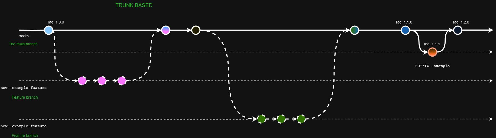
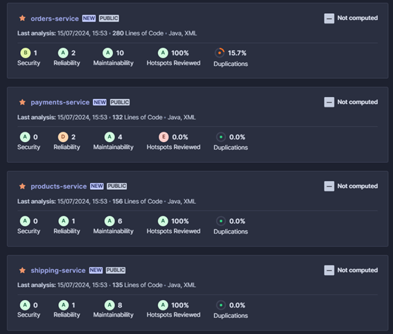
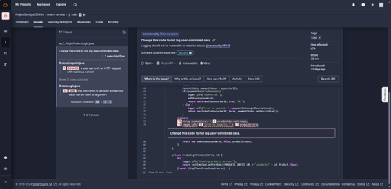
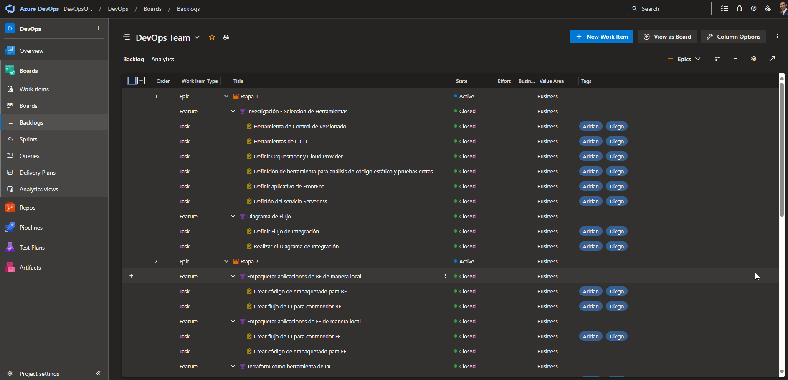
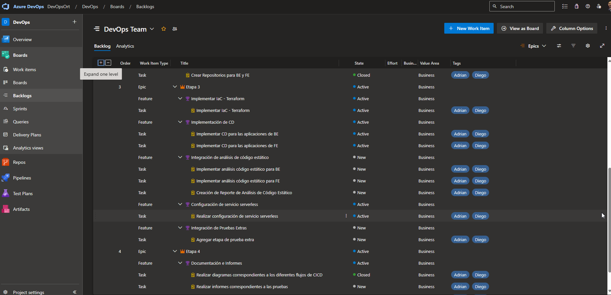

# Universidad ORT Uruguay

## Facultad de Ingeniería
### Certificación en DevOps

**Grupo de Estudiantes:** G1  
**264404 - Diego Álvez**  
**175151 – Adrián Rodríguez**  

**Tutor:** Federico Barceló  
**2024**

## ÍNDICE
- [Universidad ORT Uruguay](#universidad-ort-uruguay)
  - [Facultad de Ingeniería](#facultad-de-ingeniería)
    - [Certificación en DevOps](#certificación-en-devops)
  - [ÍNDICE](#índice)
  - [Presentación del problema](#presentación-del-problema)
  - [Impacto](#impacto)
  - [Entorno](#entorno)
  - [Sintomatología](#sintomatología)
  - [Diagnóstico](#diagnóstico)
  - [Soluciones Intentadas](#soluciones-intentadas)
  - [Objetivos](#objetivos)
  - [Mejoras en formas de Trabajo](#mejoras-en-formas-de-trabajo)
    - [Mejorar la Comunicación](#mejorar-la-comunicación)
    - [Fomentar la Colaboración](#fomentar-la-colaboración)
    - [Eliminar Barreras](#eliminar-barreras)
    - [Promover una Cultura de Aprendizaje](#promover-una-cultura-de-aprendizaje)
    - [Alinear Objetivos](#alinear-objetivos)
  - [Infraestructura](#infraestructura)
  - [Repositorio y Manejo de Ramas](#repositorio-y-manejo-de-ramas)
  - [Diagrama de flujo para DevOps](#diagrama-de-flujo-para-devops)
  - [Diagrama de flujo para Microservicios](#diagrama-de-flujo-para-microservicios)
  - [Etapas CI / CD](#etapas-ci--cd)
  - [Análisis de código estático](#análisis-de-código-estático)
  - [Resultados Obtenidos](#resultados-obtenidos)
      - [Proyecto: payments-service](#proyecto-payments-service)
        - [Resumen Ejecutivo](#resumen-ejecutivo)
        - [Detalles del Análisis](#detalles-del-análisis)
        - [Recomendaciones](#recomendaciones)
      - [Resumen Ejecutivo](#resumen-ejecutivo-1)
      - [Detalles del Análisis](#detalles-del-análisis-1)
      - [Recomendaciones](#recomendaciones-1)
      - [Resumen Ejecutivo](#resumen-ejecutivo-2)
      - [Detalles del Análisis](#detalles-del-análisis-2)
      - [Recomendaciones](#recomendaciones-2)
      - [Proyecto: orders-service](#proyecto-orders-service)
        - [Resumen Ejecutivo](#resumen-ejecutivo-3)
        - [Detalles del Análisis](#detalles-del-análisis-3)
        - [Recomendaciones](#recomendaciones-3)
  - [Testing de la aplicación](#testing-de-la-aplicación)
  - [Evidencia de Tablero Kanban](#evidencia-de-tablero-kanban)

## Presentación del problema
Durante la transformación digital de una empresa líder en retail surgió un desafío significativo en la integración de equipos de desarrollo y operaciones. Este problema se manifestó durante el lanzamiento de una nueva aplicación destinada a mejorar la experiencia de compra de los clientes donde los despliegues de nuevas versiones resultaron en errores y caídas del sistema.

## Impacto
Los errores y caídas en el sistema afectaron directamente la experiencia del usuario y la reputación de la empresa.

## Entorno
El problema ocurrió en un entorno de transición hacia prácticas DevOps con equipos separados de desarrollo y operaciones.

## Sintomatología
Despliegues de nuevas versiones de la aplicación que resultan en errores inesperados y caídas del sistema.

## Diagnóstico
El problema principal es cultural y organizativo con una falta de comunicación y colaboración efectiva entre los equipos de desarrollo y operaciones. Los desarrolladores priorizan la rapidez y la entrega continua de nuevas funciones mientras que el equipo de operaciones se enfoca en la estabilidad y disponibilidad del sistema resultando en una desconexión y falta de entendimiento mutuo.

## Soluciones Intentadas
Se han implementado herramientas de vanguardia y se han realizado esfuerzos meticulosos para mejorar el proceso pero los problemas persisten debido a la falta de una cultura de colaboración.

## Objetivos
El objetivo es desarrollar un plan de acción que fomente un ambiente de colaboración transparencia y aprendizaje continuo mejorando la comunicación y la colaboración entre los equipos eliminando barreras en los flujos de trabajo integrados y promoviendo una comprensión mutua de los desafíos y objetivos compartidos.

## Mejoras en formas de Trabajo
### Mejorar la Comunicación
Establecer canales de comunicación claros y efectivos entre los equipos de desarrollo y operaciones.

### Fomentar la Colaboración
Implementar prácticas que promuevan la colaboración y el entendimiento mutuo como reuniones conjuntas y sesiones de retroalimentación.

### Eliminar Barreras
Identificar y eliminar barreras que impidan la eficacia de los flujos de trabajo integrados.

### Promover una Cultura de Aprendizaje
Establecer una cultura de aprendizaje continuo donde los equipos compartan conocimientos y experiencias.

### Alinear Objetivos
Alinear a todos los equipos bajo un conjunto común de objetivos y prácticas para asegurar una agilidad y resiliencia operativa a largo plazo.

## Infraestructura
La infraestructura actual sufre de una falta de integración y alineación entre los equipos de desarrollo y operaciones lo que resulta en despliegues fallidos y caídas del sistema. Esta infraestructura necesita ajustes no solo técnicos sino también culturales y organizativos para garantizar una operación fluida y estable. 

Al implementar DevOps se obtienen varios beneficios y soluciones a los problemas planteados:
- Automatización del despliegue
- Infraestructura como código (IaC)
- Monitoreo y Observabilidad
- Colaboración y Comunicación
- Pruebas automatizadas
- Contenerización y Orquestación

Esta combinación de soluciones técnicas y culturales permitirá una integración más fluida y eficiente de los equipos de desarrollo y operaciones mejorando la estabilidad y la capacidad de respuesta de la infraestructura.

## Repositorio y Manejo de Ramas
El equipo ha optado por utilizar e implementar el sistema de repositorios en GitHub con un diagrama de Trunk-Based Development tanto para los repositorios de los microservicios como para el repositorio de DevOps.

La utilización de Trunk-Based Development como sistema de repositorios para microservicios y DevOps se justifica por su capacidad para mejorar la eficiencia y la colaboración entre los equipos. Este enfoque permite que los desarrolladores integren cambios pequeños y frecuentes en una rama principal (trunk) lo que facilita la detección temprana de errores y reduce los conflictos de integración. 

Además Trunk-Based Development promueve una mayor agilidad y velocidad en los despliegues lo cual es crucial en entornos de microservicios donde las actualizaciones deben ser rápidas y confiables. Al unificar el flujo de trabajo en una única rama principal se fomenta la comunicación y la transparencia alineando los objetivos de desarrollo y operaciones y asegurando una entrega continua y estable de las aplicaciones. 

## Diagrama de flujo para DevOps

## Diagrama de flujo para Microservicios

## Etapas CI / CD

## Análisis de código estático
Para la realización de las pruebas de código estático para cada uno de los microservicios se utilizó SonarCloud como herramienta.

## Resultados Obtenidos
Se realizaron las pruebas correspondientes a cada microservicio obteniendo en la mayoría de ellos resultados satisfactorios.

#### Proyecto: payments-service
**Líneas de código analizadas:** 132

##### Resumen Ejecutivo
El análisis del proyecto "payments-service" en SonarCloud indica que hay áreas críticas que requieren atención inmediata especialmente en términos de fiabilidad y mantenibilidad. A continuación se presentan los detalles y las recomendaciones correspondientes.

##### Detalles del Análisis
**Security (Seguridad):**
- 0 Problemas Abiertos
- 0 Issues Aceptados

**Reliability (Fiabilidad):**
- 2 Problemas Abiertos
  - 1 H (High)
  - 1 M (Medium)

**Maintainability (Mantenibilidad):**
- 4 Problemas Abiertos
  - 1 H (High)
  - 3 M (Medium)

**Coverage (Cobertura):**
- Cobertura de pruebas no configurada. Es necesario realizar pasos adicionales para analizar la cobertura de código.

**Duplications (Duplicación):**
- 0% de duplicación de código en 162 líneas.

##### Recomendaciones
1. **Fiabilidad:** Resolver el problema de alta severidad para evitar posibles fallos críticos en el sistema.
2. **Mantenibilidad:** Abordar primero el problema de alta severidad seguido por los de media severidad para mejorar la mantenibilidad del código.
3. **Cobertura de Pruebas:** Configurar y ejecutar un análisis de cobertura de código para asegurar que el código esté bien probado.

**Proyecto:** products-service  
**Líneas de código analizadas:** 195

#### Resumen Ejecutivo
El análisis del proyecto "products-service" en SonarCloud muestra una fiabilidad y mantenibilidad aceptables aunque se identificaron algunas áreas que requieren atención para mejorar la calidad del código.

#### Detalles del Análisis

**Security (Seguridad):**
- **0 Problemas Abiertos**
- **0 Issues Aceptados**
- **0 Security Hotspots**

**Reliability (Fiabilidad):**
- **1 Problema Abierto**
  - 1 M (Medium)

**Maintainability (Mantenibilidad):**
- **6 Problemas Abiertos**
  - 2 H (High)
  - 4 M (Medium)

**Coverage (Cobertura):**
- **Cobertura de pruebas no configurada.** Es necesario realizar pasos adicionales para analizar la cobertura de código.

**Duplications (Duplicación):**
- **0%** de duplicación de código en 195 líneas.

#### Recomendaciones
1. **Fiabilidad:** Resolver el problema de severidad media para evitar posibles fallos en el sistema.
2. **Mantenibilidad:** Abordar primero los problemas de alta severidad seguido por los de media severidad para mejorar la mantenibilidad del código.
3. **Cobertura de Pruebas:** Configurar y ejecutar un análisis de cobertura de código para asegurar que el código esté bien probado.

**Proyecto:** shipping-service  
**Líneas de código analizadas:** 135

#### Resumen Ejecutivo
El análisis del proyecto "shipping-service" en SonarCloud revela algunos problemas en la fiabilidad y mantenibilidad del código. No se detectaron problemas de seguridad ni duplicación de código.

#### Detalles del Análisis

**Security (Seguridad):**
- **0 Problemas Abiertos**
- **0 Issues Aceptados**
- **0 Security Hotspots**

**Reliability (Fiabilidad):**
- **1 Problema Abierto**
  - 1 M (Medium)

**Maintainability (Mantenibilidad):**
- **8 Problemas Abiertos**
  - 1 H (High)
  - 7 M (Medium)

**Coverage (Cobertura):**
- **Cobertura de pruebas no configurada.** Es necesario realizar pasos adicionales para analizar la cobertura de código.

**Duplications (Duplicación):**
- **0%** de duplicación de código en 166 líneas.

#### Recomendaciones
1. **Fiabilidad:** Resolver el problema de severidad media para evitar posibles fallos en el sistema.
2. **Mantenibilidad:** Abordar primero el problema de alta severidad seguido por los de media severidad para mejorar la mantenibilidad del código.
3. **Cobertura de Pruebas:** Configurar y ejecutar un análisis de cobertura de código para asegurar que el código esté bien probado.

#### Proyecto: orders-service
**Líneas de código analizadas:** 344

##### Resumen Ejecutivo
El análisis del proyecto "orders-service" en SonarCloud revela varias áreas de mejora en términos de seguridad fiabilidad y mantenibilidad del código. A continuación se detallan los hallazgos más significativos y se ofrecen recomendaciones para abordar los problemas detectados.

##### Detalles del Análisis
**Security (Seguridad):**
- 1 Problema Abierto
  - Severidad: 1 L (Low)
- 0 Issues Aceptados
- 0 Security Hotspots

**Reliability (Fiabilidad):**
- 2 Problemas Abiertos
  - Severidad: 2 M (Medium)
  - Sin problemas de alta gravedad

**Maintainability (Mantenibilidad):**
- 10 Problemas Abiertos
  - Severidad: 2 H (High)
  - 5 M (Medium)
  - 3 L (Low)

**Coverage (Cobertura):**
- Cobertura de pruebas no configurada. Se requieren pasos adicionales para analizar la cobertura de código.

**Duplications (Duplicación):**
- 15.7% de duplicación de código en 344 líneas.

##### Recomendaciones
1. **Seguridad:** Revisar y corregir el problema de baja severidad identificado para fortalecer la seguridad del código.
2. **Fiabilidad:** Abordar los dos problemas de severidad media para mejorar la fiabilidad del servicio.
3. **Mantenibilidad:** Priorizar la resolución de los dos problemas de alta severidad seguido por los de media y baja severidad.
4. **Cobertura de Pruebas:** Configurar y ejecutar un análisis de cobertura de código para asegurar que el código esté bien probado.
5. **Duplicación:** Reducir la duplicación de código para mejorar la mantenibilidad y reducir la complejidad del código.

En el repositorio donde Orders se detectaron vulnerabilidades y fallas de seguridad.

## Testing de la aplicación

Se implementó una solución en AWS Lambda para realizar el testing de los microservicios Backend mediante la implementación de pruebas con Newman/Postman pero no se terminó de implementar en su totalidad.

Por lo que no se cuenta con evidencia de los testeos realizados.

## Evidencia de Tablero Kanban

La herramienta seleccionada para el tablero Kanban fue Azure DevOps.

- Se tomaron cuatro etapas para el desarrollo cada una con sus Epics - Features - Historias de Usuario y Task.

